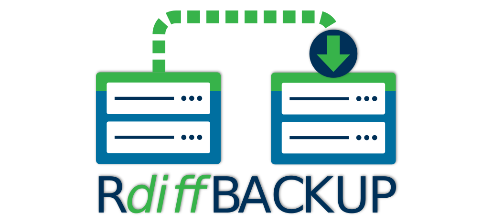

:doctype: book
:sectnums:
:toc!:

[.text-center]
link:https://rdiff-backup.net/[*website*] .
link:https://github.com/rdiff-backup/rdiff-backup/releases[*download*] .
link:https://lists.nongnu.org/mailman/listinfo/rdiff-backup-users[*community*]

[.text-center]
image:https://img.shields.io/github/license/rdiff-backup/rdiff-backup["License",link="COPYING"]
image:https://bestpractices.coreinfrastructure.org/projects/6072/badge["OpenSSF Best Practices",link="https://bestpractices.coreinfrastructure.org/projects/6072"]
image:https://github.com/rdiff-backup/rdiff-backup/actions/workflows/test_linux.yml/badge.svg[Linux]
image:https://github.com/rdiff-backup/rdiff-backup/actions/workflows/test_windows.yml/badge.svg[Windows]
image:https://github.com/rdiff-backup/rdiff-backup/actions/workflows/jekyll-gh-pages.yml/badge.svg[Pages]

= rdiff-backup

rdiff-backup is a simple backup tool which can be used locally and remotely, on Linux and Windows, and even cross-platform between both.
Users have reported using it successfully on FreeBSD and MacOS X.

Beside its ease of use, one of the main advantages of rdiff-backup is that it does use the same efficient protocol as rsync to transfer and store data.
Because rdiff-backup only stores the differences from the previous backup to the next one (a so called https://en.wikipedia.org/wiki/Incremental_backup#Reverse_incremental[reverse incremental backup]), the latest backup is always a full backup, making it easiest and fastest to restore the most recent backups, combining the space advantages of incremental backups while keeping the speed advantages of full backups (at least for recent ones).

If the optional dependencies pylibacl and pyxattr are installed, rdiff-backup will support https://en.wikipedia.org/wiki/Access-control_list#Filesystem_ACLs[Access Control Lists] and https://en.wikipedia.org/wiki/Extended_file_attributes[Extended Attributes] provided the file system(s) also support these features.

== INSTALLATION

See xref:docs/migration.adoc[how to migrate side-by-side] for migration considerations.

=== Linux, BSD & Co

==== The simplest way

The `rdiff-backup` package is xref:#_packaging_status_in_distros[available in many distributions] and you can often simply use the standard system installation method.
We can't list them all but here two examples from the command line:

.It doesn't go simpler
[source,shell]
----
sudo apt install rdiff-backup  # Debian, Ubuntu & Co
sudo dnf install rdiff-backup  # Fedora
----

==== With EPEL for RHEL, CentOS (Stream), etc

.Click here for the instructions
[%collapsible]
====

.RHEL 9, 10 and their replicas (from EPEL)
[source,shell]
----
sudo dnf config-manager --set-enabled crb  #<1>
sudo dnf install epel-release
sudo dnf install rdiff-backup
----
<1> There are https://access.redhat.com/articles/4348511[different instructions to enable CodeReady Builder (CRB) on RHEL].

.RHEL 8 and its replicas (from EPEL)
[source,shell]
----
sudo dnf install epel-release
sudo dnf --enablerepo=PowerTools install rdiff-backup
----

NOTE: you can add the option `--setopt=install_weak_deps=False` to the last line if you don't need ACLs and EAs support.
You can install `python3-pylibacl` and `python3-pyxattr` also separately.
Under RHEL, the repo to enable is https://access.redhat.com/documentation/en-us/red_hat_enterprise_linux/8/html/package_manifest/codereadylinuxbuilder-repository[codeready-builder-for-rhel-8-x86_64-rpms] in order to get access to pyxattr, instead of PowerTools.

NOTE: This does not enable updates for `PowerTools`, check the distribution documentation for details on how to do this.

.RHEL 7 and its replicas (from EPEL)
[source,shell]
----
sudo yum install epel-release
sudo yum install rdiff-backup
sudo yum install py3libacl pyxattr  #<1>
----
<1> the last line is optional to get ACLs and EAs support.

====

==== More complex ways for anything UN*X-oid (from PyPi)

.Click here for the instructions
[%collapsible]
====

You need to make sure that the following requirements are met, using your system's package/software/application manager, searching there for the following keywords:

* __Python__, 3.10 or higher
* Python __pip__ or __pip3__, e.g. with `python -m ensurepip --upgrade`
* __librsync__ or __librsync2__, 2.0.0 or higher
* __libacl__ or __libacl1__ or simply __acl__ (optional, to support ACLs)
* SSH, generally __OpenSSH__, client and/or server (optional, for remote operations)

Here two examples on how to install the dependencies.

.Install dependencies for CentOS (Stream), RHEL 9 & 10, etc
[source,shell]
----
sudo dnf install python3-pip python3-devel gcc libacl-devel
sudo dnf install epel-release  #<1>
sudo dnf install librsync-devel  #<1>
----
<1> Only necessary if the pip install command complains about a missing `librsync.h`.

.Install dependencies for Debian and derivatives, Raspbian, etc
[source,shell]
----
sudo apt install python3-pip python3-setuptools python3-pylibacl python3-pyxattr
sudo apt install build-essentials librsync-dev  #<1>
----
<1> Probably necessary if your platform is not i386 or amd64, e.g. ARM/MIPS/etc

Then you should only need to call one of the following commands before you can use rdiff-backup:

[source,shell]
----
pip3 install rdiff-backup        # without optional dependencies
pip3 install rdiff-backup[meta]  # with support for metadata, ACLs and EAs
----

CAUTION: You can install diff-backup using pip as root (with `sudo` in front) or as normal user, depending on your use case.
Beware that it is generally not recommended to mix system and pip libraries.
Hence make sure that you don't install via pip any dependency already packaged for your distro.
Consider the usage of a https://docs.python.org/3/library/venv.html[virtual environment (virtualenv or venv)] to be extra sure (at the price of added complexity we won't detail here).

If even this fails or you want to install the absolutely latest and greatest, have a look at the xref:docs/DEVELOP.adoc#_build_and_install[Development documentation] for other ways to install.

====

=== Windows

For _remote_ operations, you will need to have an SSH package installed.
The standard one provided by Microsoft is probably your safest choice, else we recommend using OpenSSH from http://www.mls-software.com/opensshd.html[mls-software.com].

NOTE: starting with rdiff-backup 2.1.1 embedding Python 3.10, rdiff-backup https://www.python.org/downloads/windows/[cannot be used on Windows 7 or earlier].

==== Install using our packages

. Go to https://github.com/rdiff-backup/rdiff-backup/releases[releases section].
. Check the _assets_ attached to the latest releases available.
. Download and unpack the file `rdiff-backup-VERSION.win64exe.zip` (or win32 if need be).
. Drop the binary `rdiff-backup.exe` somewhere in your `PATH`.
. It should work, as it comes with all dependencies included.

==== Install using Chocolatey

Another way to install rdiff-backup is to use https://chocolatey.org/[Chocolatey]:

. Install https://docs.chocolatey.org/en-us/choco/setup/[Chocolatey] (if not already done)
. Call https://community.chocolatey.org/packages/rdiff-backup#install[choco install rdiff-backup].

== BASIC USAGE

Creating your first backup is as easy as calling `rdiff-backup <source-dir> <backup-dir>` (possibly as root), e.g.
`rdiff-backup -v5 /home/myuser /run/media/myuser/MYUSBDRIVE/homebackup` would save your whole home directory (under Linux) to a USB drive (which you should have formatted with a POSIX file system, e.g.
ext4 or xfs).
Without the `-v5` (v for verbosity), rdiff-backup isn't very talkative, hence the recommendation.

Subsequent backups can simply be done by calling exactly the same command, again and again.
Only the differences will be saved to the backup directory.

If you need to restore the latest version of a file you lost, it can be as simple as copying it back using normal operating system means (cp or copy, or even pointing your file browser at the backup directory).
E.g.
taking the above example `cp -i /run/media/myuser/MYUSBDRIVE/homebackup/mydir/myfile /home/myuser/mydir/myfile` and the lost file is back!

There are many more ways to use and tweak rdiff-backup, they're documented in the man pages, in the link:docs/[documentation directory], or on https://rdiff-backup.net[our website].

== TROUBLESHOOTING

If you have everything installed properly, and it still doesn't work, see the enclosed xref:docs/FAQ.adoc[FAQ], the https://rdiff-backup.net/[rdiff-backup web page] and/or the https://lists.nongnu.org/mailman/listinfo/rdiff-backup-users[rdiff-backup-users mailing list].

We're also happy to help if you create an issue to our https://github.com/rdiff-backup/rdiff-backup/issues[GitHub repo].
The most important is probably to explain what happened with which version of rdiff-backup, with which command parameters on which operating system version, and attach the output of rdiff-backup run with the very verbose option `-v9`.

The FAQ in particular is an important reference, especially if you are using smbfs/CIFS, Windows, or have compiled by hand on Mac OS X.

== CONTRIBUTING

Rdiff-backup is an open source software developed by many people over a long period of time.
There is no particular company backing the development of rdiff-backup, so we rely very much on individual contributors who "scratch their itch".
*All contributions are welcome!*

There are many ways to contribute:

* Testing, troubleshooting and writing good bug reports that are easy for other developers to read and act upon
* Reviewing and triaging https://github.com/rdiff-backup/rdiff-backup/issues[existing bug reports and issues], helping other developers focus their efforts
* Writing documentation (e.g.
the xref:docs/rdiff-backup.1.adoc[man page]), or updating the webpage rdiff-backup.net
* Packaging and shipping rdiff-backup in your own favorite Linux distribution or operating system
* Running tests on your favorite platforms and fixing failing tests
* Writing new tests to get test coverage up
* Fixing bug in existing features or adding new features

If you don't have anything particular in your mind but want to help out, just browse the list of issues.
Both coding and non-coding tasks have been filed as issues.

For source code related documentation see xref:docs/DEVELOP.adoc[docs/DEVELOP.adoc].
To provide meaningful bug reports and help with testing, please use the latest development release or the https://github.com/rdiff-backup/rdiff-backup/releases/tag/weekly[weekly release].

== PACKAGING STATUS IN DISTROS

image::https://repology.org/badge/vertical-allrepos/rdiff-backup.svg?columns=4&minversion=2.2[Packaging status,link=https://repology.org/project/rdiff-backup/versions]
