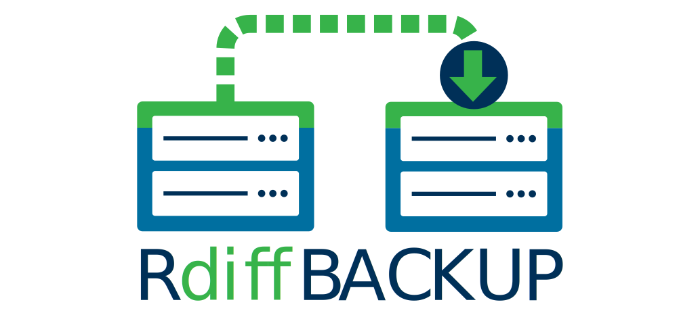

=  rdiff-backup: list
:sectnums:

Reverse differential backup tool, over a network or locally

[[pages]]
xref:../index.adoc[Home] xref:./features.adoc[Features]
xref:./docs.adoc[Documentation]
xref:./acknowledgments.adoc[Acknowledgement] xref:./related.adoc[Related
pages]

'''''

If you have a question about rdiff-backup or want to report a bug, try
posting to the mailing list. Thanks to the Savannah project and the Free
Software Foundation for hosting this mailing list.

* http://mail.freesoftware.fsf.org/mailman/listinfo/rdiff-backup-users[Main
mailing list page] - subscribe here.
* http://mail.freesoftware.fsf.org/pipermail/rdiff-backup-users/[Shortcut
to current archives]

Update 9/25/2002:::
  The rdiff-backup mailing list was formerly hosted by
  keywest.stanford.edu. The keywest administrator recently obtained his
  degree and left for a real job. His absence was noted a couple weeks
  later (9/20)... Anyway, it's unclear if/when keywest will be back up,
  so I applied for and received a Savannah account. Thank you very much,
  Savannah, for your support.
  +
  I am not automatically resubscribing keywest.stanford.edu mailing list
  members because it may break their filtering and because they did not
  consent to receive mail from the new list. *So former subscribers,
  please
  http://mail.freesoftware.fsf.org/mailman/listinfo/rdiff-backup-users[subscribe]
  again if you still want to receive rdiff-backup traffic.* Sorry for
  the inconvenience, and I hope the new situation is more stable.
